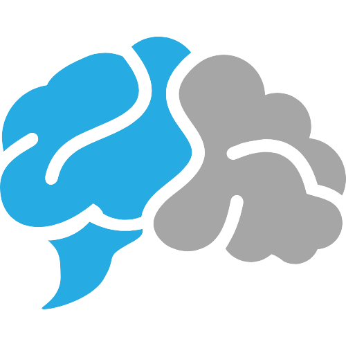

<!-- PROJECT LOGO -->
 

  

  <h3 align="center">RevisIA</h3>

  

    A deliberate reassociation engine based on Harvard's  <a href="https://implicit.harvard.edu/implicit/selectatest.html">"Weapons IAT"</a>
     
     
    <a href="https://iandraves.github.io/RevisIA/">LIVE DEMO!</a>
    ·
    <a href="https://github.com/iandraves/RevisIA/issues">Report Bug</a>
    ·
    <a href="https://github.com/iandraves/RevisIA/issues">Request Feature</a>
  

<!-- ABOUT THE PROJECT -->

## About The Project

[![Product Name Screen Shot][product-screenshot]](https://example.com)

RevisIA helps you change your implicit associations with weapons and race. The following activity is a modified version of the "Weapons IAT", requiring you to deliberately associate harmless objects with the race you currently associate with weapons and weapons with the race you currently associate with harmless objects. Deliberate reassociation is proven to change implicit attitudes.

Specifically, once you click begin, you will categorize the images seen on the left reassociatively. For example, if your IAT results indicate that you implicitly associate weapons with black Americans, then you will be asked to categorize harmless objects with black Americans and weapons with white Americans. Unlike the "Weapons IAT", you will not be attempting to sort these images as quickly as possible. Instead, it is important that you take your time to sort images accurately.

Once you complete a level, another level will load automatically. There are an infinite number of levels (they are procedurally generated), so you can complete as many levels as you would like. However, for true reassocation to happen, it is reccomended that this be a frequent practice until your results on the "Weapons IAT" consistently show a difference.

You will not be corrected if you miscategorize items. If, and when, you do, reflect on that. Did you quickly place a harmless object in the wrong category? a weapon? These are important details to notice and correct on your own.

(<a href="#top">back to top</a>)

### Built With

This section should list any major frameworks/libraries used to bootstrap your project. Leave any add-ons/plugins for the acknowledgements section. Here are a few examples.

-   [Vanilla JavaScript]()
-   [UIKit](https://getuikit.com/)

(<a href="#top">back to top</a>)

<!-- LICENSE -->

## License

Distributed under the MIT License. See `LICENSE.txt` for more information.

(<a href="#top">back to top</a>)

<!-- MARKDOWN LINKS & IMAGES -->

[product-screenshot]: img/screenshot.png
